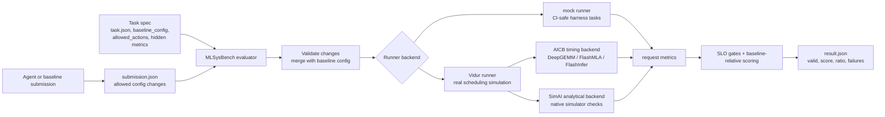

# MLSysBench

A benchmark for evaluating LLMs and AI agents on **LLM inference optimization** tasks — spanning kernel programming, algorithm design, and system-level optimization.

## Motivation

Large language models and AI coding agents are increasingly used to write and optimize code. But can they optimize *themselves* — i.e., can an AI agent profile an LLM inference workload, identify bottlenecks, and implement effective optimizations?

Existing benchmarks cover parts of this space but not the whole picture:
- [KernelBench](https://github.com/ScalingIntelligence/KernelBench) and its ecosystem (KernelBenchX, AgentKernelArena, FastKernels, SOL-ExecBench) evaluate kernel generation/optimization — but only at the kernel layer.
- [InferenceBench](https://github.com/aisa-group/InferenceBench) evaluates agents on inference serving deployment — but focuses on framework selection and hyperparameter tuning, not kernel writing or algorithm implementation.
- [PIE](https://pie4perf.com/) and [ECCO](https://ecco-code-eff.github.io/) evaluate code optimization edits — but on competitive programming, not inference systems.

**No benchmark evaluates the full-stack LLM inference optimization capability** — from analysis and decision-making to kernel implementation, algorithm design, and system-level optimization. MLSysBench aims to fill this gap.

## Benchmark Design

### Current Overview



### Results-Driven Evaluation

We evaluate agents by **measured performance outcomes**, not by code similarity to reference solutions. Each task provides an unoptimized baseline — the agent's job is to make it faster while preserving correctness. Even if an agent memorizes open-source code, what matters is whether its optimization achieves real speedup.

### Two-Level Task Hierarchy

| Level | Focus | # Tasks | What it tests |
|-------|-------|---------|---------------|
| **L2: Implementation** | Optimize specific kernels, algorithms, or system components | 10-15 | Can the agent write faster code given a baseline? |
| **L3: End-to-End Optimization** | Full optimization pipeline on real models | 5-8 | Can the agent *independently optimize* a real inference workload? |

### Evaluation Metrics

| Dimension | Metric | Description |
|-----------|--------|-------------|
| Correctness | Numerical equivalence | Optimized output matches baseline output |
| Performance | Speedup ratio | `baseline_time / optimized_time` |
| Quality | MMLU-Pro gate | Model accuracy stays within tolerance |
| Efficiency | Interaction rounds | How many rounds the agent needs |

## Documentation

- [Survey of Existing Benchmarks](docs/existing-benchmarks.md)
- [Survey of Inference Optimization Competitions](docs/competitions.md)
- [Inference Optimization Task Taxonomy](docs/task-taxonomy.md)
- [Benchmark Design Proposal](docs/design-proposal.md)
- [Data Sources & Task Construction](docs/data-sources.md)
- [Evaluation Environment](docs/environment.md)
- [SimAI Codebase Analysis](docs/simai-analysis.md)
- [SimAI-Based Benchmark Methodology](docs/simai-benchmark-proposals.md)
- [SimAI Benchmark Code Scaffold](docs/simai-benchmark-code.md)

## SimAI Benchmark Scaffold

Run the bundled smoke-test task:

```bash
python3 -m mlsysbench.simai_bench evaluate \
  --task tasks/simai_gym/l1_scheduler_choice \
  --submission submissions/examples/sarathi_scheduler.json
```

This validates task specs, allowed action diffs, SLO gates, and
baseline-relative scoring. The included task uses a mock runner so the harness
works without a full SimAI build; real tasks can switch to the Vidur runner.

Run the same task through the model-agent path:

```bash
python3 -m mlsysbench.simai_bench run-agent \
  --task tasks/simai_gym/l1_scheduler_choice \
  --provider dry-run \
  --output-dir runs/dry_run_l1_scheduler
```

For an OpenAI-compatible model endpoint, create `.env` from `.env.example` and
fill in `MODEL_API_KEY`, `MODEL_BASE_URL`, and `MODEL_NAME`. The CLI loads this
file automatically:

```bash
python3 -m mlsysbench.simai_bench run-agent \
  --task tasks/simai_gym/l1_scheduler_choice \
  --provider openai-compatible \
  --api-key-env MODEL_API_KEY \
  --output-dir runs/model_l1_scheduler
```

### Running Real SimAI/Vidur/AICB

The bundled example task uses the mock runner. Real SimAI, native Vidur, and
AICB-backed Vidur runs require a CUDA host and Python 3.10/3.11 because AICB
loads CUDA PyTorch, vLLM, DeepGEMM, FlashMLA, FlashInfer, grouped_gemm, and
Triton kernels.

Use the runbook in [docs/simai-benchmark-code.md](docs/simai-benchmark-code.md)
for the full setup and commands. The runbook includes the RTX 5880 Ada
compatibility path used in this repository: DeepGEMM FP8 kernels are used on
supported sm90/sm100 GPUs, while sm89 hosts fall back to real CUDA bf16 matmul
timing rather than mock/default timings.

Current implementation status:

| Component | Status | Notes |
|-----------|--------|-------|
| Mock harness task | Complete | `tasks/simai_gym/l1_scheduler_choice` runs without CUDA. |
| Native Vidur smoke | Complete | Real `python -m vidur.main` path verified. |
| SimAI analytical smoke | Complete | `third_party/SimAI/bin/SimAI_analytical` build verified. |
| Direct AICB workload generation | Complete | Qwen3-Next-80B CSV generation verified on CUDA host. |
| Vidur + AICB smoke | Complete | Reproducible via `scripts/run_real_simai_vidur_aicb_smoke.sh`. |
| Real Vidur+AICB benchmark task | Complete | `tasks/simai_gym/qwen3_next_aicb_benchmark` runs a 32-request workload. |
| Multi-scenario benchmark matrix | Pending | Need sweeps across QPS, request counts, models, and backends. |
| GPU CI | Pending | Current CI-safe tests cover harness logic, not CUDA execution. |

Run the real CUDA benchmark task:

```bash
python -m mlsysbench.simai_bench evaluate \
  --task tasks/simai_gym/qwen3_next_aicb_benchmark \
  --submission submissions/examples/qwen3_next_aicb_benchmark_baseline.json
```

Run the wrapper script for the same non-smoke 32-request profile:

```bash
scripts/run_real_simai_vidur_aicb_benchmark.sh
```

Run the one-request CUDA health check:

```bash
scripts/run_real_simai_vidur_aicb_smoke.sh
```

For a CI-safe command construction check:

```bash
DRY_RUN=1 scripts/run_real_simai_vidur_aicb_smoke.sh
```

## Coverage

```
Kernel Level                    Algorithm Level              System Level
├── CUDA (GEMM, Attention)      ├── Quantization             ├── Operator Fusion
├── Triton (GQA, PagedAttn)     ├── Pruning & Sparsity       ├── Memory Management
├── NKI (AWS Trainium)          ├── Speculative Decoding      ├── Scheduling (Batching)
└── Custom Op Wrapping          ├── KV Cache Optimization     ├── Parallelism Config
                                └── MoE Optimization          └── Compilation
```

## Related Work

### Most Related (Agent-Level Evaluation)
- [InferenceBench](https://github.com/aisa-group/InferenceBench) (Agents Workshop 2026) — Agent inference serving deployment benchmark (config tuning focus)
- [AgentKernelArena](https://arxiv.org/abs/2605.16819) (AMD, 2026) — Agent kernel optimization with generalization testing (kernel-only)
- [PerfCodeBench](https://arxiv.org/abs/2605.15222) (2026) — System-level high-performance code optimization (general, not inference-specific)

### Kernel Generation Benchmarks
- [KernelBench](https://github.com/ScalingIntelligence/KernelBench) (Stanford, ICML 2025) — GPU kernel generation, 250+ tasks
- [KernelBenchX](https://github.com/BonnieW05/KernelBenchX) (Tsinghua, 2026) — 176 Triton kernel tasks
- [FastKernels](https://arxiv.org/abs/2605.23215) (Snowflake/CMU, 2026) — Production-aligned kernel benchmark
- [MultiKernelBench](https://github.com/wzzll123/MultiKernelBench) (NJU, 2025) — Cross-platform (CUDA/Triton/AscendC/Pallas/SYCL)
- [SOL-ExecBench](https://github.com/NVIDIA/SOL-ExecBench) (NVIDIA, 2026) — Roofline-scored kernel evaluation on B200
- [TritonBench](https://github.com/thunlp/TritonBench) (Tsinghua, ACL 2025) — 184 Triton operators

### Code Optimization Benchmarks
- [PIE](https://pie4perf.com/) (ICLR 2024) — Performance-improving edits for C++ code
- [ECCO](https://ecco-code-eff.github.io/) (CMU, EMNLP 2024) — Code computational optimality
- [ParEval](https://github.com/parallelcodefoundry/ParEval) (UMD, HPDC 2024) — Parallel code generation

### Competitions
- [MLSys 2026 FlashInfer Full-Agent Track](https://mlsys26.flashinfer.ai/) — First competition with a pure-AI kernel generation track

## License

MIT
