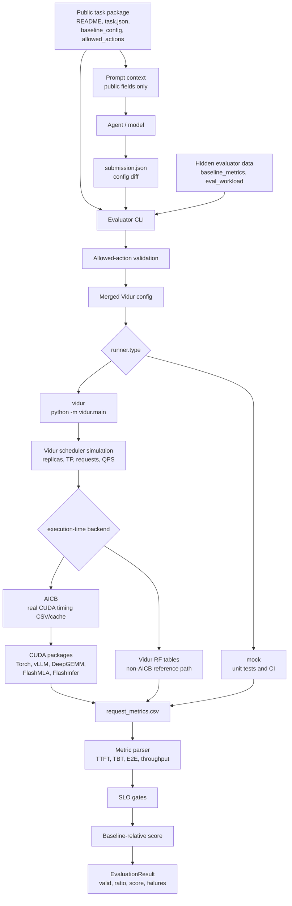

# Implementation and CUDA Runbook

This document describes the current implementation and the host-specific
Vidur+AICB setup used for the checked-in real baseline summaries. Start with
the [repository README](../README.md) for the dependency-free quick start and
read [Status and roadmap](status-and-roadmap.md) before interpreting results.

The implementation includes:

- task specification loading
- allowed action validation
- baseline config + submission diff merging
- runner abstraction (`mock` and `vidur`)
- Vidur metrics parsing
- SLO gates
- baseline-relative scoring
- CLI evaluation

## Benchmark Overview



Run the bundled smoke test task:

```bash
python -m mlsysbench.simai_bench evaluate \
  --task tasks/simai_gym/l1_scheduler_choice \
  --submission submissions/examples/sarathi_scheduler.json
```

Run the model-agent path without network access:

```bash
python3 -m mlsysbench.simai_bench run-agent \
  --task tasks/simai_gym/l1_scheduler_choice \
  --provider dry-run \
  --output-dir runs/dry_run_l1_scheduler
```

Run an OpenAI-compatible model endpoint:

```bash
cp .env.example .env
# Fill MODEL_API_KEY in .env.

python3 -m mlsysbench.simai_bench run-agent \
  --task tasks/simai_gym/l1_scheduler_choice \
  --provider openai-compatible \
  --api-key-env MODEL_API_KEY \
  --output-dir runs/model_l1_scheduler
```

The agent runner writes:

```text
runs/<run_name>/
├── prompt_context.json   # public task context shown to the model
├── submission.json       # model-produced changes
└── result.json           # evaluator output
```

`prompt_context.json` contains only public task data:

- task metadata
- README / symptoms / public report if present
- `baseline_config`
- `allowed_actions`
- objective and SLO

The model API never receives files under `hidden/`. Hidden workload and hidden
baseline metrics are read only by the evaluator.

Real SimAI/Vidur tasks should use `runner.type = "vidur"` in `task.json` and
provide a valid `vidur_root`, timeout, and output directory. The evaluator will
run `python -m vidur.main` with the merged flat config.

## Real SimAI/Vidur/AICB Runbook

The scaffold has two execution layers:

- `mock`: dependency-free harness tests and task protocol validation.
- `vidur`: real `python -m vidur.main` execution against the SimAI/Vidur tree.

### 1. Python and CUDA Environment

Use Python 3.10 or 3.11 on the CUDA host. Python 3.12+ can run parts of Vidur,
but AICB's CUDA stack is pinned around vLLM, DeepGEMM, FlashMLA, FlashInfer, and
grouped_gemm packages that are safer on Python 3.10/3.11.

```bash
# One working local setup uses uv to provision CPython 3.11.
python3 -m pip install uv
uv venv --python 3.11 .venv311

.venv311/bin/python -m pip install -U pip setuptools wheel packaging ninja cmake
.venv311/bin/python -m pip install torch torchvision torchaudio \
  --index-url https://download.pytorch.org/whl/cu128
```

Install Vidur and AICB dependencies:

```bash
.venv311/bin/python -m pip install \
  -r third_party/SimAI/vidur-alibabacloud/requirements.txt
.venv311/bin/python -m pip install -e third_party/SimAI/vidur-alibabacloud

CUDA_HOME=/usr/local/cuda-12.9 \
CC=/usr/bin/gcc-12 CXX=/usr/bin/g++-12 CUDAHOSTCXX=/usr/bin/g++-12 \
FLASH_MLA_DISABLE_SM100=1 \
PATH=/home/haiyuan/MLSysBench/.venv311/bin:/usr/local/cuda-12.9/bin:$PATH \
LD_LIBRARY_PATH=/usr/local/cuda-12.9/lib64:$LD_LIBRARY_PATH \
  .venv311/bin/python -m pip install --no-build-isolation \
  -r third_party/SimAI/aicb/requirements.txt
```

If `vllm` changes the installed Torch version, rebuild source-built CUDA
packages against the final Torch ABI:

```bash
CUDA_HOME=/usr/local/cuda-12.9 \
CC=/usr/bin/gcc-12 CXX=/usr/bin/g++-12 CUDAHOSTCXX=/usr/bin/g++-12 \
FLASH_MLA_DISABLE_SM100=1 \
PATH=/home/haiyuan/MLSysBench/.venv311/bin:/usr/local/cuda-12.9/bin:$PATH \
LD_LIBRARY_PATH=/usr/local/cuda-12.9/lib64:$LD_LIBRARY_PATH \
  .venv311/bin/python -m pip install --force-reinstall --no-deps \
  --no-build-isolation --no-cache-dir \
  git+https://github.com/fanshiqing/grouped_gemm@v1.0 \
  git+https://github.com/deepseek-ai/DeepGEMM.git@594953acce41793ae00a1233eb516044d604bcb6 \
  git+https://github.com/deepseek-ai/FlashMLA.git@1408756a88e52a25196b759eaf8db89d2b51b5a1 \
  git+https://github.com/flashinfer-ai/flashinfer.git@9c264c0b5ad76593d7d343f4a5711a4fa6fdc909
```

Expected import check:

```bash
CUDA_HOME=/usr/local/cuda-12.9 \
PATH=/home/haiyuan/MLSysBench/.venv311/bin:/usr/local/cuda-12.9/bin:$PATH \
LD_LIBRARY_PATH=/home/haiyuan/MLSysBench/.venv311/lib/python3.11/site-packages/torch/lib:/usr/local/cuda-12.9/lib64:$LD_LIBRARY_PATH \
  .venv311/bin/python -c \
  "import torch, vllm, grouped_gemm, deep_gemm, flash_mla, flashinfer; \
   print(torch.__version__, torch.cuda.is_available(), torch.cuda.get_device_name(0)); \
   print(vllm.__version__)"
```

### 2. Build SimAI Analytical Backend

The analytical backend is separate from AICB and is useful for checking native
SimAI execution:

```bash
PATH=/home/haiyuan/MLSysBench/.venv311/bin:$PATH \
  ./third_party/SimAI/scripts/build.sh -c analytical
```

Expected binary:

```text
third_party/SimAI/bin/SimAI_analytical
```

### 3. RTX 5880 / Ada Compatibility

On RTX 5880 Ada (`sm_89`), current DeepGEMM may emit `sm_89a` for JIT
compilation and its FP8 GEMM kernels are not supported for this architecture.
Use:

```bash
export DG_JIT_NVCC_COMPILER=/home/haiyuan/MLSysBench/scripts/deepgemm_nvcc_sm89_wrapper.sh
export TORCH_CUDA_ARCH_LIST=8.9
```

The wrapper only rewrites `--gpu-architecture=sm_89a` to `sm_89` before
delegating to `/usr/local/cuda-12.9/bin/nvcc`. For unsupported DeepGEMM FP8
runtime calls on sm89, AICB uses a real CUDA bf16 matmul timing fallback in
`third_party/SimAI/aicb/utils/deepgemm_utils.py`; it does not return mock
constants. On sm90/sm100 GPUs, the same helper still prefers DeepGEMM FP8.

### 4. Direct AICB Workload Generation

Useful direct checks on the CUDA host:

```bash
cd third_party/SimAI/aicb
CUDA_HOME=/usr/local/cuda-12.9 \
PATH=/home/haiyuan/MLSysBench/.venv311/bin:/usr/local/cuda-12.9/bin:$PATH \
LD_LIBRARY_PATH=/home/haiyuan/MLSysBench/.venv311/lib/python3.11/site-packages/torch/lib:/usr/local/cuda-12.9/lib64:$LD_LIBRARY_PATH \
DG_JIT_NVCC_COMPILER=/home/haiyuan/MLSysBench/scripts/deepgemm_nvcc_sm89_wrapper.sh \
TORCH_CUDA_ARCH_LIST=8.9 \
  /home/haiyuan/MLSysBench/.venv311/bin/python \
  -m workload_generator.Vidur_workload_generator \
  Qwen3-Next-80B ./scripts/inference_configs/qwen3_next_default.json \
  --seq_length 100 --micro_batch 1 --world_size 32 \
  --tensor_model_parallel_size 1 --expert_model_parallel_size 32 \
  --aiob_enable --phase decode
```

Successful output includes real per-kernel timing and writes:

```text
third_party/SimAI/aicb/results/aiob_outputs/Qwen3-Next-80B-world_size32-tp1-pp1-ep32-bpg1-seq100-decode.txt
third_party/SimAI/aicb/results/workload/vidur-Qwen3-Next-80B-world_size32-tp1-pp1-ep32-bs1-seq100-decode.csv
```

### 5. Vidur with AICB Backend

For the default non-smoke benchmark profile, run:

```bash
python -m mlsysbench.simai_bench evaluate \
  --task tasks/simai_gym/qwen3_next_aicb_benchmark \
  --submission submissions/examples/qwen3_next_aicb_benchmark_baseline.json
```

The benchmark task runs a 32-request synthetic workload with AICB-backed layer
timings. The smoke task is intentionally separate and should be used only as a
fast CUDA/AICB health check:

```bash
scripts/run_real_simai_vidur_aicb_smoke.sh
```

For a reproducible shell wrapper around the non-smoke profile:

```bash
scripts/run_real_simai_vidur_aicb_benchmark.sh
```

Both wrappers perform the CUDA import check, direct AICB workload generation,
Vidur+AICB simulation, CSV/header validation, and a guard against the
`AICB data is empty` default path. Defaults can be overridden with environment
variables such as `PYTHON_BIN`, `CUDA_HOME`, `OUTPUT_ROOT`, `NUM_REQUESTS`,
`PREFILL_TOKENS`, and `DECODE_TOKENS`.

Run a small end-to-end Vidur simulation using AICB timing:

```bash
cd third_party/SimAI/vidur-alibabacloud

CUDA_HOME=/usr/local/cuda-12.9 \
PATH=/home/haiyuan/MLSysBench/.venv311/bin:/usr/local/cuda-12.9/bin:$PATH \
LD_LIBRARY_PATH=/home/haiyuan/MLSysBench/.venv311/lib/python3.11/site-packages/torch/lib:/usr/local/cuda-12.9/lib64:$LD_LIBRARY_PATH \
DG_JIT_NVCC_COMPILER=/home/haiyuan/MLSysBench/scripts/deepgemm_nvcc_sm89_wrapper.sh \
TORCH_CUDA_ARCH_LIST=8.9 \
  /home/haiyuan/MLSysBench/.venv311/bin/python -m vidur.main \
  --replica_config_pd_p2p_comm_bandwidth 800 \
  --replica_config_nvlink_bandwidth 1600 \
  --replica_config_rdma_bandwidth 800 \
  --replica_config_pd_p2p_comm_dtype fp8 \
  --replica_config_network_device h20_dgx \
  --replica_config_device h20 \
  --request_generator_config_type synthetic \
  --interval_generator_config_type poisson \
  --poisson_request_interval_generator_config_qps 100 \
  --synthetic_request_generator_config_num_requests 1 \
  --length_generator_config_type fixed \
  --fixed_request_length_generator_config_prefill_tokens 100 \
  --fixed_request_length_generator_config_decode_tokens 8 \
  --trace_request_length_generator_config_trace_file ./data/processed_traces/splitwise_conv.csv \
  --random_forrest_execution_time_predictor_config_backend aicb \
  --random_forrest_execution_time_predictor_config_aicb_force_bs1 \
  --cluster_config_num_replicas 32 \
  --replica_config_pd_node_ratio 1 \
  --global_scheduler_config_type lor \
  --replica_scheduler_config_type sarathi \
  --replica_config_model_name qwen3-next-80B \
  --replica_config_tensor_parallel_size 1 \
  --replica_config_num_pipeline_stages 1 \
  --metrics_config_output_dir /home/haiyuan/MLSysBench/runs/real_bench/aicb_scenario1_fullcuda_sm89_forcebs1 \
  --no-metrics_config_store_plots \
  --no-metrics_config_enable_chrome_trace
```

`--random_forrest_execution_time_predictor_config_aicb_force_bs1` avoids
invalid empty-batch AICB subprocess attempts and reuses/generated real `bs=1`
CSV timing. The cache log should show exact hits/interpolation and no
`AICB data is empty` default path:

```text
third_party/SimAI/vidur-alibabacloud/data/aicb_workload/logs/aicb_cache_log.txt
```

Verified local output:

```text
runs/real_bench/aicb_scenario1_fullcuda_sm89_forcebs1/2026-07-02_12-17-02-908733/request_metrics.csv
```

The checked-in non-smoke 32-request baseline records:

```text
num_requests = 32
goodput_rps = 129.9910913076327
p99_e2e_ms = 0.302036216334331
p99_ttft_ms = 0.058094700876077515
p99_tbt_ms = 0.030492689432282116
```

The one-request smoke result recorded for health checks:

```text
request_e2e_time = 0.00027766230338086006
request_num_tokens = 108
request_num_prefill_tokens = 100
request_num_decode_tokens = 8
```

The first supported action space is intentionally limited to the code-verified
surface:

```text
TP / PP / replica count / scheduler / batch cap / Sarathi chunk size /
PD on-off / P:D ratio / PD bandwidth sensitivity / QPS under SLO
```

EP search, EP/AllToAll network scoring, topology-aware PD congestion,
heterogeneous scheduling, and prefix-aware routing are future extensions.
